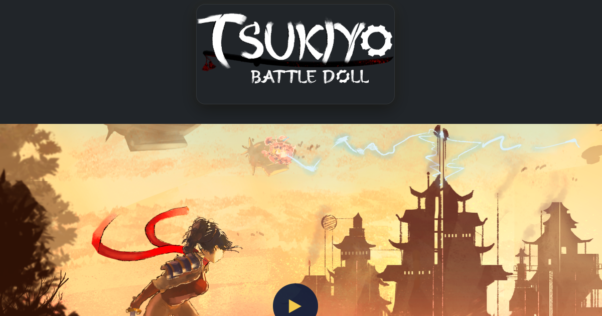

# Juan Carlos Suarez - Gameplay Programmer Portfolio

Version: 1.0

Professional gameplay programming portfolio focused on Unity development, AI systems, combat mechanics, tactical gameplay architecture and technical game design.

---

# Live Website

https://alejandroarevaloprogrammer.github.io/juan-carlos/

---

# Preview

This image is used for:
- Open Graph previews
- Twitter cards
- Discord previews
- LinkedIn previews
- WhatsApp previews

Recommended resolution:
1200x630

---

# Features

- Responsive design
- Dynamic navbar and footer components
- Custom project modal system
- Swiper integration
- Gameplay showcase videos
- Mobile and tablet optimized
- EmailJS contact form integration
- SEO metadata
- Open Graph support
- Twitter card support
- GitHub Pages compatible

---

# Technologies Used

- HTML5
- CSS3
- JavaScript
- Bootstrap 5
- Swiper.js
- AOS Animation Library
- EmailJS

---

# Local Development

Use VSCode Live Server:

1. Open the project folder in VSCode.
2. Right click `index.html`.
3. Select `Open with Live Server`.

Do not open the HTML files directly using `file://`
because navbar and footer components are loaded dynamically using JavaScript `fetch()`.

---

# GitHub Pages

This project is fully compatible with GitHub Pages.

Main URL:

https://alejandroarevaloprogrammer.github.io/juan-carlos/

---

# Project Structure

index.html
about.html
games.html
contact.html

robots.txt
sitemap.xml

assets/

  components/
    navbar.html
    footer.html

  css/
    style.css

  js/
    main.js

  img/
  gifs/
  video/

  preview.png

---

# Assets

Place your media files inside:

assets/img/
assets/gifs/
assets/video/

---

# SEO

This project includes:
- robots.txt
- sitemap.xml
- canonical URLs
- Open Graph metadata
- Twitter metadata

---

# License

This portfolio and its source code are intended for personal and professional showcase purposes.
